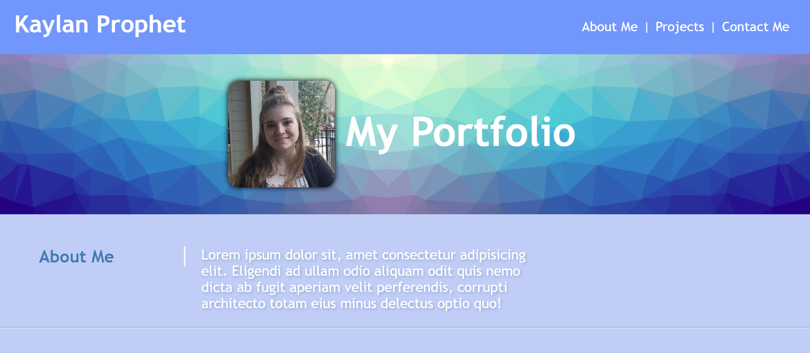

# Kaylan Prophet Portfolio

This portfolio is to show case my projects as I learn and develop my coding skills. The document consist of an HTML and CSS file. 

## **<a href="https://kaylanprophet.github.io/kaylan-prophet-portfolio/">Visit my portfolio!</a>**

### Summary 
The HTML contains the elements used to create a navigation bar, a hero and heading, about me article, projects gallery, and a footer. After the foundation of the webpage was estblished in the HTML, depth was added with the use of CSS. This gave the webpage life adjusting fonts, colors, and images on the webpage. 
